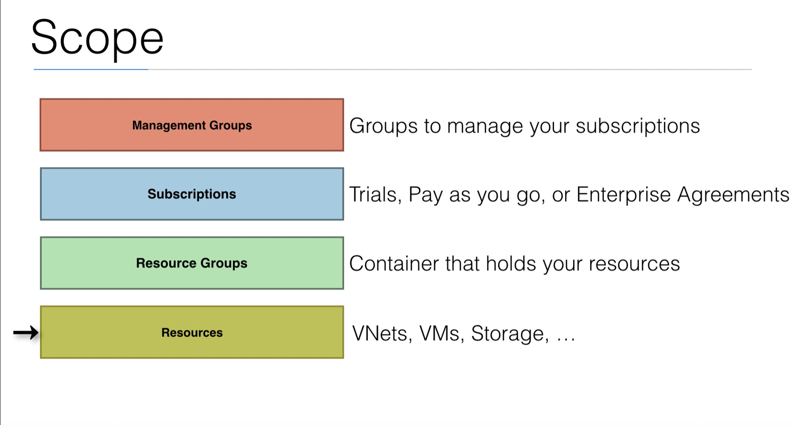

# Resource Manager

- The Resource Manager is a **deployment and management service** in Azure
- It's the management layer to **create, update, and delete** resources in your Azure subscription
- The terraform AzureRM plugin uses the Azure SDK to connect to the Resource Manager
  - The resource manager provides **authentication and authorization**

## Resource diagram

- Azure portal will automatically connect to Azure Resource Manager
- Azure CLI (python SDK) or Terraform (written in go uses Go SDK) to connect to Azure Resource Manager
- Rest Clients will use http requests to go directly to Azure Resource Manager
- Azure Resource Manager provides **Authentication and Authorization**
  - Will log you in, check authentication
  - We also have role based access control, which will check authorization to modify a certain resource

- Under ARM we have azure resources:
 - Data Store
 - Virtual Machine
 - Database
 - etc.

## Scope Diagram

- Resources are individual componenets
- Those resources can be grouped into Resource Groups which is a container that holds **like** resources
  - These are not generally the same **type of resources** (Ex: All network security groups, all VMs)
  - Instead, they should be a logical grouping of **all resources in a project**
  - Ex: For the first demo, we used one resource group to house all the resources we created in that demo.
- When you first open a new Azure account, you'll have a trial subscription.
  - A subscription can be used to house all resource groups and those resource groups are tied to that subscription
  - That subscription is then paying for all the resources in all resource groups within that subscription
- Management Groups can house all the subscriptions for a given Enterprise or Entity
  - This is used to house all the subscriptions within the Enterprise Agreement
  - Most people will not work with these, except for the people that manage all the groups in an Enterprise
  - A Management Group, for example, would manage each subscription as it pertains to a department within an Enterprise, or a Team within a Department

## Resource Groups

- **Azure Resources** (VMs, Network Interfaces, VNets) are grouped in **Resource Groups**
  - Resource groups are the **logical containers** that hold your resources
- Resource groups are **part of the Resource Manager**
- A resource can **only exist within a single Resource Group**
  - A resource from one Resource Group can still use a resource from another resource group if the permissions allow it
  - For example, you can use a VNet created in one Resource Group, within another Resource Group
- Even though you assign a Resource Group to a single **region**, this is only where the **metadata** is saved
  - You can **still create resources in other regions that use this resource**
- You can also **move a resource** from one resource group to another

- In the short demos we do, we will use 1 resource group
- In real life scenarios, you will want to use Resource Groups for better **governance** and **cost management**
  - **Role Based Access Control (RBAC)** can be applied on the resource group level, allowing you to provide access to users on a resource group level
  - That is one of the major benefits to using resource groups
  - **Tagging** resources can help for billing purposes, but also for automated processes, or audits
  - Resource Groups will also allow you to **effectively manage your costs**

