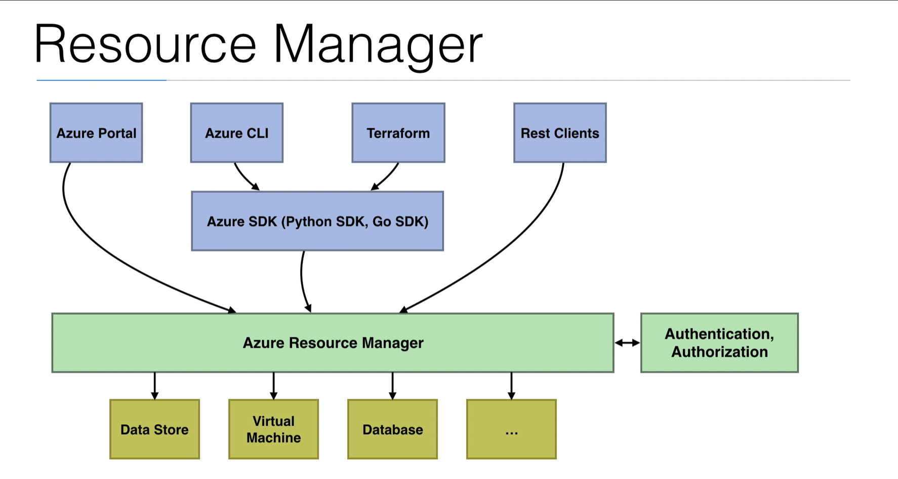

# Resource Manager

- The Resource Manager is a **deployment and management service** in Azure
- It's the management layer to **create, update, and delete** resources in your Azure subscription
- The terraform AzureRM plugin uses the Azure SDK to connect to the Resource Manager
  - The resource manager provides **authentication and authorization**

## Resource diagram

