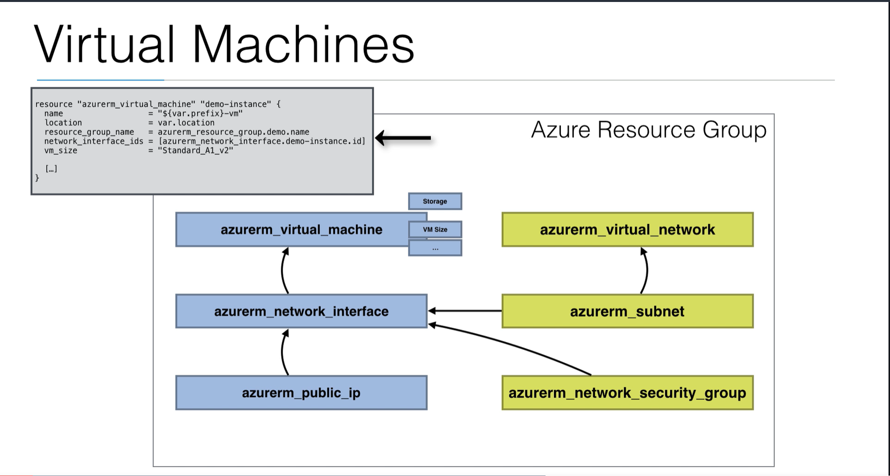

# Virtual Machines
- In the first steps demo, I showed you how to launch a VM
  - It might help you to open instance.tf file again and have another look at it
- In this lecture, I will go over some of the **common arguments** you can use with VMs
- Besides the arguments explained here, there are **many others**
  - For a complete list, you should always refer to the **terraform documentation**
  - https://registry.terraform.io/providers/hashicorp/azurerm/latest/docs/resources/virtual_machine

## VM Diagram

- Here is an overview of the dependencies of our first steps demo
  - In the top left, there is a small snippet that shows you a little bit of the dependencies in code
  - Every resource needs a resource group, so we created every resource depending on this resource group
  - we refer to this resource group with the following syntax:
    - `resource_group_name = azurerm_resource_group.demo.name`
  - The virtual machine itself has storage, vm size, and other configurations possible
  - before we can create the virtual machine, we have a dependency on the network interface
    - `network_interface_ids = [azurerm_network_interface.demo-instance.id]`
  - This network interface depends on a public ip so we can have a public ip on this network inferface, so we can have a public ip on our VM
  - To create a network interface, we also need a subnet
  - To have a subnet, we also have to create a VNet with an address space
  - The network interface can also have a network security group which is also something we attach to the network interface

- Terraform will first create the resource group
  - Then the virtual network
  - Then the subnet
  - Then the network security group
  - Then the public IP
  - Then the network interface
  - Then the VM

- It is also important to note you can have a network security group attached to either a network interface, or a subnet, but **you don't generally attach it to both because it can get complicated to manage.**

## Virtual Machine Code walkthrough
- At this point, open instance.tf in a separate window
- You typically need **the following to launch a VM:**
  - a name
  - the location (typically the same region as your other resources)
  - The Resource Group
  - A Network Interface
  - The Image (for example Ubuntu)
  - Storage for the OS disk
  - The VM size (Standard_A1_v2)
  - The OS profile (and a linux or windows path)
  - We will talk about the resources at the bottom shortly

## Network Interface
- Network interface
  - You can assign a **Network Security Group** to create firewall rules for your instance
  - You can assign a **private and/or public IP address to a network interface**
    - The public IP is an external internet routable IP address
    - The private IP is within your VNet range
    - The allocation can be Dynamic or Static
  - For **private IP addresses:**
    - IP addresses will be released when the network interface is deleted
    - When using Dynamic allocation, the next unassigned IP address within the subnet's IP range will be assigned
      - For example, within a subnet 192.168.0.0/24:
      - You have 192.168.0.1-192.168.0.3 reserved
      - Then, if available 192.168.0.4 will be assigned first. If it is taken by another resource in the subnet, then 192.168.0.5 will be assigned, and so on.
    - When using a static allocation, you can pick the private IP yourself
  - For **public IP addresses:**
    - You have a **Basic SKU** (default) and a **Standard SKU** (which supports Availability Zone scenarios)
    - Basic SKUs can be Dynamic or Static, Standard SKUs only Static
    - When assigning a Dynamic public IP, the IP will not be assigned yet when you create the public_ip resource. It'll only be assigned when the VM is started
      - The IP is deleted when you stop or delete the resource for a Dynamic IP
    - If you want a static IP (immediately assigned), then you can choose for Static type, and you'll get a static IP from an available public IP pool, until you delete the public_ip resource
      - The IP will not be deleted when you stop or delete the network interface, enabling you to attach it to another resource

## Virtual Machines
- The Image:
  - You can find images using the **marketplace**
  - Typically when you find a publisher, you can list the offers and SKUs that you need in terraform by using (CLI):
    - `az vm image list -p "Microsoft"`
    - `az vm image list -p "Canonical"`
- Head to the portal in your browser
  - sign in and type "marketplace" in the search, click
  - in the marketplace search, type "ubuntu" then enter
  - You will then see all the available images (they will have either Canonical or Microsoft on their badge)
  - Click the one you want and you can find out all the details you need to setup terraform
  - copy paste the publisher (will be Canonical or Microsoft in this case), go to the terminal and type:
    - `az vm image list -p "Canonical"
    - This will only show the latest one
    - You can view all by doing:
    - `az vm image list -p "Canonical" --all
  - If we then go back and look at our instance.tf inside of the field "storage_image_reference" you will see all the details you need
  - if you type `az vm image list -h` you will get the help so you can see the params you can use to filter.
    - in my experience, it is easier to use the marketplace to find the image that you want, and then can use `az vm image list` to find the correct args you need for terraform
- **OS Storage** is needed to launch a VM
- This is provided by an **Azure Managed disk**
  - This is a highly durable and available virtualized disk with three replicas of your data
- Interesting arguments to mention here are:
  - caching: you can choose what kind of caching you want locally (on the VM): None, ReadOnly, or ReadWrite
    - depends how much caching you want on your VM. We want some caching on our managed disk to make it quicker.
    - managed_disk_type:
      - LRS stands for "locally redundant storage" which replicates the data three times within one datacenter
      - You can choose between Standard_LRS (which is standard hard disk and is very slow), StandardSSD_LRS (which is a bit more expensive but has better performance), and if you need very good performance you go with Premium_LRS or UltraSSD_LRS
- VM Size:
  - General Purpose, Compute optimized, Memory Optimized, Storage optimized, GPU, High performance Compute
  - This depends on the use case of your application.
  - With most use cases for standard applications you will use **General Purpose**
    - Within general purpose, you have different types
    - For the demo, we used the Av2-series which is a good VM for **entry level workloads** but not scaling applications
    - Other types in General Purpose:
      - **B**, Dsv3, Dv3, Dasv4, Dav4, DSv2, Dv2, **Av2**, DC
      - Av2 is entry level workloads
      - B-series is anotjer interesting type, because it is **burstable** - ideal for workloads that do not need **full performance** of the CPU continuously
- OS Profile (os_profile):
  - This is where you can set computer name, login and password
- OS Profile for Linux (os_profile_linux_config):
  - Here you can configure an SSH key instead of a password if desired, which I would recommend
  - Can disable password authentication altogether and only rely on SSH authentication which is more secure

  
  
    
  