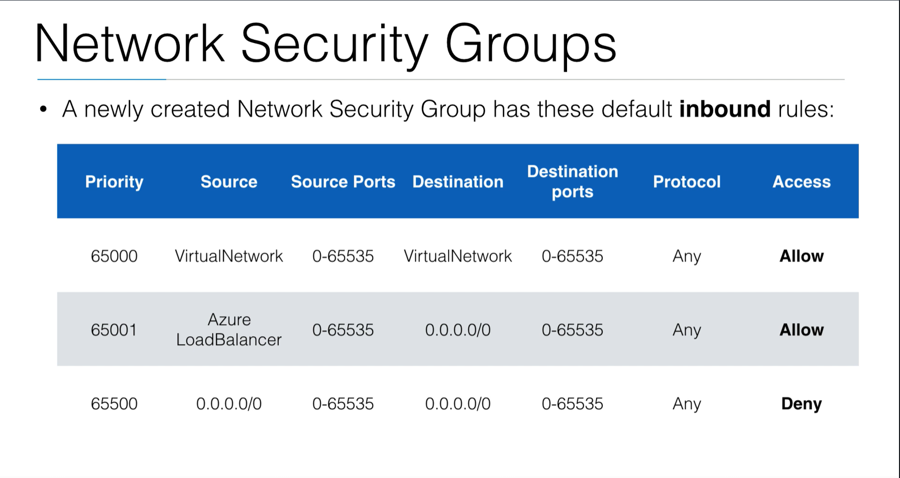
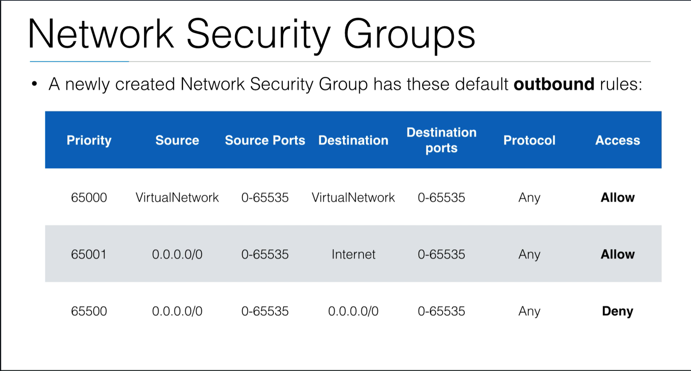
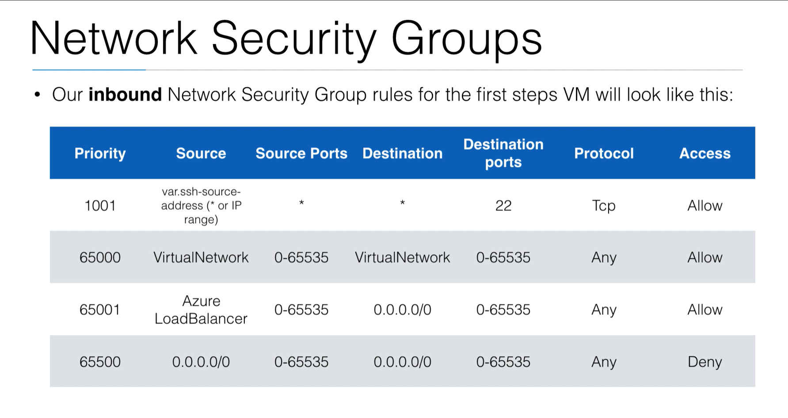
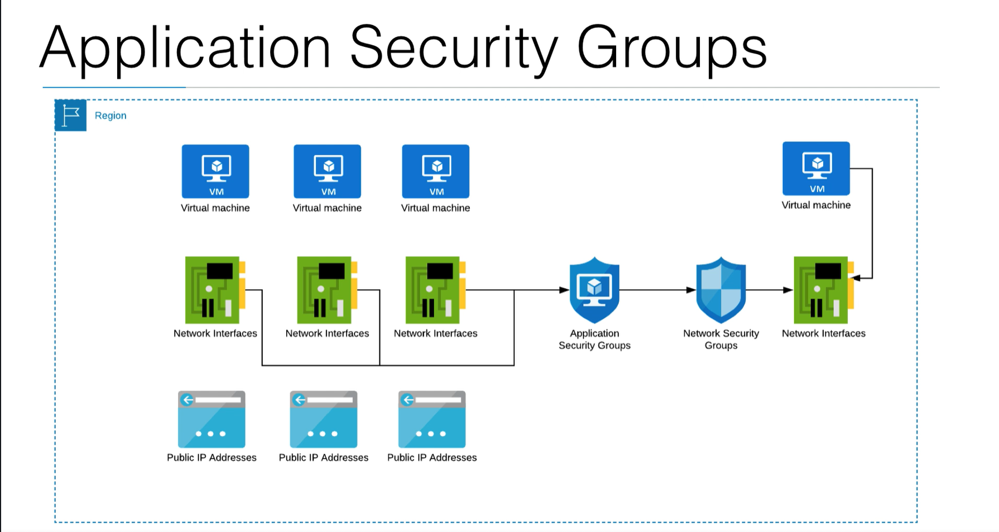
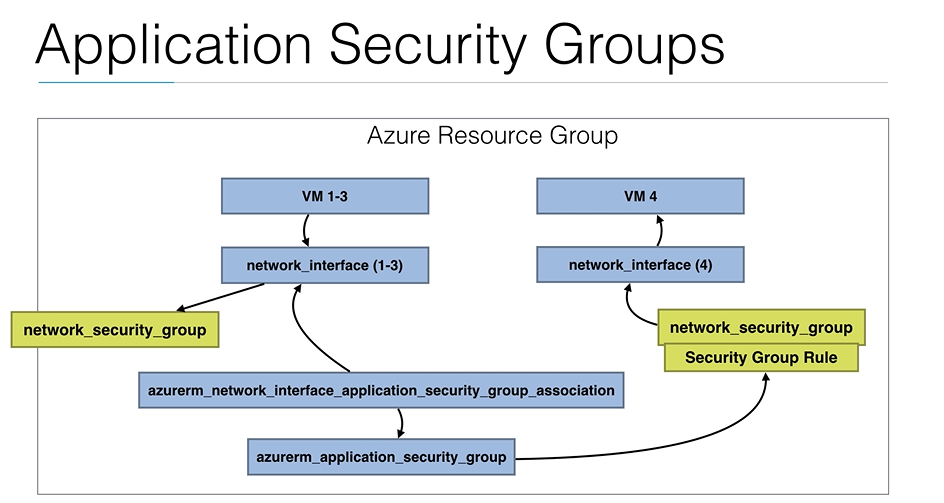

# Network Security Groups (NSG)
- Network Security Groups **can filter traffic** from and to Azure resources
- A NSG **consists of security rules** which have the following params:
  - Name: **unique name** of the security group
  - Priority: A **number** between **100 and 4096,** with lower numbers processed first
  - **Source & destination IP range** (or alternatively a service tag / application security group)
    - where does the traffic come from, where does it go to? Match within an IP range
  - **Source & Destination Port Range**
  - **IP Protocol:** TCP / UDP / ICMP / Any
  - Direction: **incoming / outgoing**
  - Action: **Allow / Deny**
    - What am I going to do when this rule matches? Allow it, or deny it?

## NSG Terraform Example
- At this point, open network.tf, this contains the relevant terraform code for the NSG from the first steps demo
  - "allow-ssh" is the name of the rule
  - we have a name
  - location
  - resource group name
  - and a security rule corresponding to the name "allow-ssh"
    - This security rule is specifically for ssh configured traffic
  - This is now the security_rule that is attached to our network security group that allows ssh traffic to our VM
  - the traffic can be specific (if you assign a variable in the `var.ssh-source-address`)
  - it will allow ssh from anywhere if no IP range is specified in the variable

## Default NSG Rules from Azure
- A newly created NSG has these default **inbound rules**:

- 2 allow rules
  - The first allow rule has a higher priority than the deny rule, so it will allow all traffic from the virtual network
  - The second allow rule has a higher priority than the deny rule, so it will allow all traffic from the Azure Load Balancer (if one exists)
- 1 deny rule
  - The last rule is going to deny all ports and all IP's if no higher priority rule is specified

- A newly created NSG has these default **outbound rules**:

- 2 allow rules
  - The first allow rule has a higher priority than the deny rule, so it will allow all traffic to go to the virtual network
  - The second allow rule has a higher priority than the deny rule, so it will allow all traffic to the internet
    - You can add another rule here that blocks outbound traffic to the internet
    - or you can add a rule that says you need to pass through your own proxy before the internet to deny internet traffic and only allow traffic to the proxy vm
    - On the proxy VM, you might allow access to the internet, perhaps if the other VM had all rule management
- 1 deny rule
  - block outbound to other computers
  
## Our Inbound NSG
- After applying this NSG to our Azure account, our inbound rules will look like this:

- 3 Allow rules
  - the 2 defaults were applied
  - Our "allow-ssh" rule was applied:
    - highest priority
    - our source is going to be star (meaning all IPs can ssh if they have the key) or an IP address that we specify (ex: 192.162.0.1/32) would allow a single IP with that address to ssh in
- 1 Deny rule
  - the default rule to block outbound to other computers

## NSGs
- When creating security groups, instead of IP addresses, you can use **Service Tags** or **Application Security Groups**
- **Service Tags** are predefined by Azure, for example:
  - VirtualNetwork: The VirtualNetwork address space, for example 10.0.0.0/16
  - AzureLoadBalancer: translates to the Virtual IP where Azure health checks originates from
  - Internet: Outside of the VNet, reachable by the public internet

## Application Security Groups (ASGs)
- Application Security Groups allow you to **group Virtual Machines**
- Instead of using IP addresses, you can use **group names** instead, making your Network Security Groups much easier to maintain
- You will need to associate (link) one or more Network Interfaces to an ASG
  - You can associate **multiple network interfaces** that make up 1 application and call the ASG "MyApplication"
- Afterwards you'll be able to use that "MyApplication" within a network security rule, rather than specifying the single IP addresses

## ASG Diagram

- Let's say you have 3 VMs that are a part of your application
- You can take the 3 Network Interfaces, put those in an Application Security Group, for example with the name "MyApplication"
- Then you can use the ASG in your Network Security Groups as a NSG rule.
- You can then attach that NSG to another network interface so that you only need 1 rule to allow all the machines on the left to access the machine on the right.
- Without Application Security Groups, you'd need 3 rules because you have 3 IP addresses for 3 VMs
- With ASG's you bundle those Network Interfaces, and so you only need 1 NSG rule

## Terraform ASG Diagram

- This diagram shows how it is done in terraform
  - VM 1-3 will have 3 network interfaces (network_interface (1-3))
  - These will have 1 network_security_group to allow traffic to this VM
  - Then you will have an azurerm_network_interface_application_security_group_association which will associate the 3 network interfaces with 1 ASG
  - You then need only one security group rule, which will be your ASG (more on this coming up in the next demo)

## Security Groups Troubleshooting
- When creating infrastructure, how do you troubleshoot security groups?
- A few general tips:
  - If you're getting "Connection timeout" then it's most likely the security group that is blocking you
    - This can also be that the VM is not responding (low likelihood) or you're using the wrong DNS / IP
  - If you're getting "Connection refused", you can reach the VM, and it's the VM that sends you back that the port is not open
    - probably not the security group, but rather the VM itself (okay this port is open, but there's nothing running on it currently)
  - If you're getting a SSH key error, check whether you're using the correct key, and whether you're passing your private key correctly

  