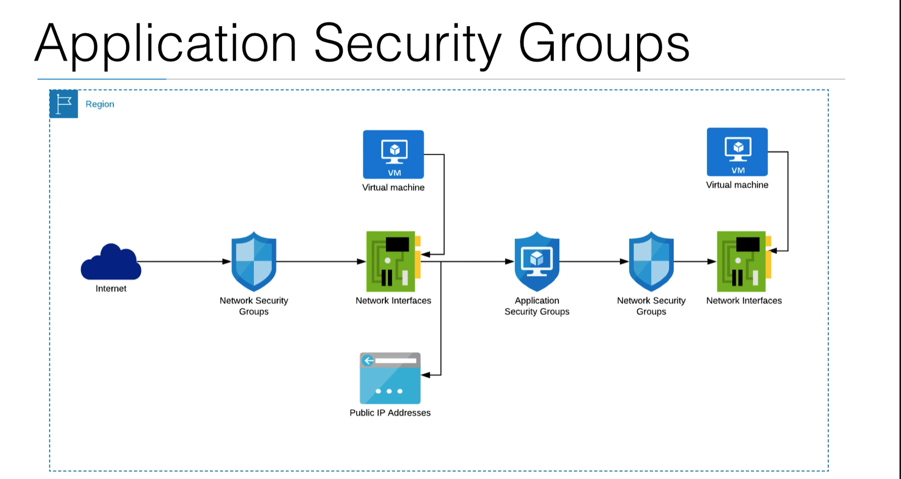

# Network Security Groups Demo
In this demo, we will do the following represented by the diagram

## Application Security Groups Diagram

- We will have:
  - One VM connect to the internet
  - Public IP address
  - Network Interface
  - NSG
  - ASG to attach that Network Interface to it
  - Then use that Application Security Group in our second NSG
  - We will attach the second NSG to a second Network Interface for a second VM

- We can test by going to our first VM and make a connection to our second VM on a certain port to see whether it works.
